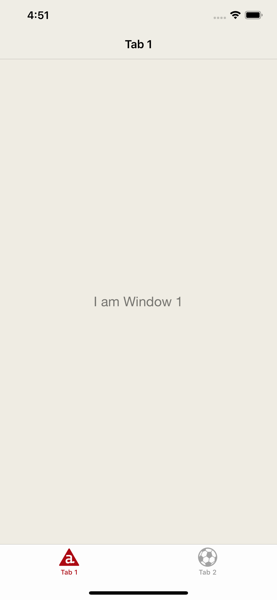
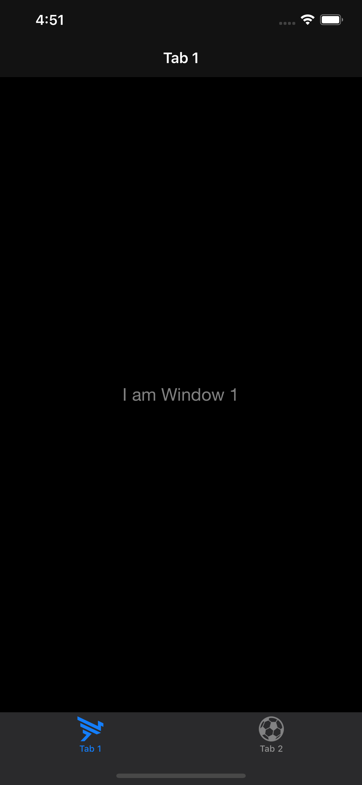
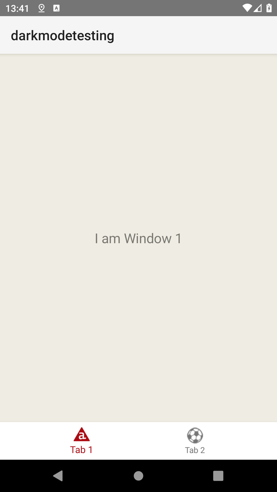
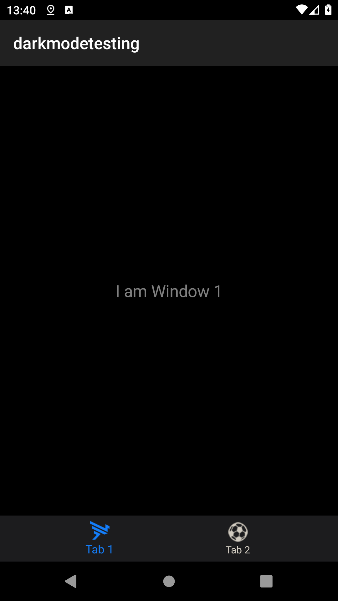

# Dark Mode Example

## Requirements

### iOS
- [x] iOS 13+
- [x] Titanium SDK 8.2.0

### Android
- [x] Android 10+
- [x] Titanium SDK 8.2.0
- [ ] Bug. [`AC-6374`](https://jira.appcelerator.org/browse/AC-6374) `Android: Semantic Colors with alpha value` ([Patch](https://github.com/drauggres/titanium_mobile/commit/bc526dddc4ec592263ad21e256c7bdfc8073bfdd.patch))
- [ ] Improvement. [`AC-6389`](https://jira.appcelerator.org/browse/AC-6389) `Android: Be able to determine dark / light theme, as well as changes on it` ([Patch](https://github.com/drauggres/titanium_mobile/commit/edcad21e8b5500b56ab2305bb2861face7b09a3e.patch))
- [ ] New Feature. [`TIMOB-26734`](https://jira.appcelerator.org/browse/TIMOB-26734) `Android: Add "activeTabIconTint" support to TabGroup` ([Patch](https://github.com/drauggres/titanium_mobile/commit/6426302561a81d241025a31a8ffd8914bf5446db.patch))

